# VPC with servers in private subnets and NAT
## OVERVIEW:
In this project,entailed the design, implementation, and configuration of a highly secure and scalable Virtual Private Cloud (VPC) on Amazon Web Services (AWS), tailored to support the deployment of web applications and services. The VPC architecture features a sophisticated network topology, comprising public and private subnets, each configured with customized routing tables and access controls. This design enables seamless communication between internal components, while providing tightly controlled internet access through carefully configured network address translation (NAT) gateways and security groups, thereby ensuring the confidentiality, integrity, and availability of sensitive data and applications.

## STEP 1:  Log in to AWS Management Console
a.Navigate to the AWS Management Console and ensure you are in the region where you want to create the VPC.
## STEP 2: Create a New VPC
### 1.Go to VPC Dashboard:
a.In the AWS Console, search for VPC in the search bar and click on it.

### 2.Create the New VPC:
a.Click Create VPC. 
b.Choose "Create VPC and more". 
c.Name your VPC, define an IPv4 CIDR block (network range), and select a default tenancy. 

### 3.Configure Subnets:
a.For high availability, pick at least 2 Availability Zones. 
b.Create public and private subnets for resource management (e.g., 1public, 2private). 
c.Set up a NAT gateway choose 1 per AZ. 
d.Leave VPC endpoints as "None" unless required. 

### 4. Create VPC:
e.Click "Create VPC" to complete the setup. 

## STEP 3:Create an Auto Scaling Group
### 1.Navigate to the EC2 Console.
a. Navigate to Services > EC2 under the Compute section. 
b.Select "Auto Scaling groups" from the menu .  
c.Click Create Auto Scaling group. 

### 2.Create a Launch Template:
a.Open the AWS Management Console and go to the EC2 dashboard after click on Launch Templates option in EC2 dashbord. 
b.Click the "Create launch template" button. 

c.Provide a Name and Description for your launch template.  

d.Select a Amazon Machine Image AMI (Ubuntu server). 
e.Select a free tier eligible instance type(eg.t2.micro). 
f.Create the key pair (use same key pair). 
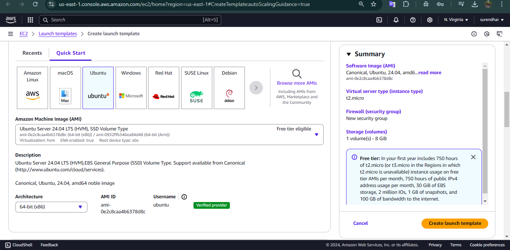

### 3.Create a Security Group:
a.Click the "Create Security Group" button. 
b.Provide a Name and Description for the security group. 

### 4.Configure Security Group Rules:
#### I.Inbound Rules:
Type: SSH, Protocol: TCP, Port Range: 22, Source: Anywhere IPv4 
Type : All Traffic , Protocol: All, Port Range: All, Source: Anywhere IPv4 
Type: All TCP, Protocol: TCP, Port Range: All, Source: Anywhere IPv4 

#### II.Outbound Rules:
Type: All Traffic, Protocol: All, Port Range: All, Destination: Anywhere IPv4 
Click "Create Security Group" to finalize. 
### 5.Save the Launch Template:
a.Set any additional configurations as needed. 
b.Click "Create launch template" to save your configuration. 

### 6.Configure Auto Scaling Group Settings:
a.Enter a name for your Auto Scaling group. 
b.Choose a pre-created Launch Template defining your instance configuration. 
c.Select the VPC where your instances will be launched. 
d.Choose private subnets with in the selected VPC. 
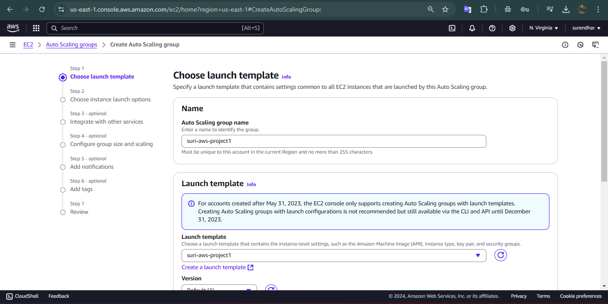

### 7.Scaling Settings:
a.Minimum Capacity: Set the minimum number of instances (select2). 
b.Maximum Capacity: Set the maximum number of instances (select4). 
c.Desired Capacity: Set the initial number of instances (select 2). 

### 8.Finalize the Auto Scaling Group:
a.Configure any additional settings as needed. 
b.click Create Auto Scaling group.  

## STEP 4:Create an Instance
1.Navigate to Services > EC2 from the top menu. 
2.Click on Instances from the left-hand menu, then click on the Launch Instances button to start creating a new instance. 
3.Choose an Amazon Machine Image (AMI). 
4.Select an AMI based on your requirements. For example: 
a.Use Ubuntu AMI for general-purpose workloads. 
b.Pick a pre-configured AMI if your application requires specific software. 
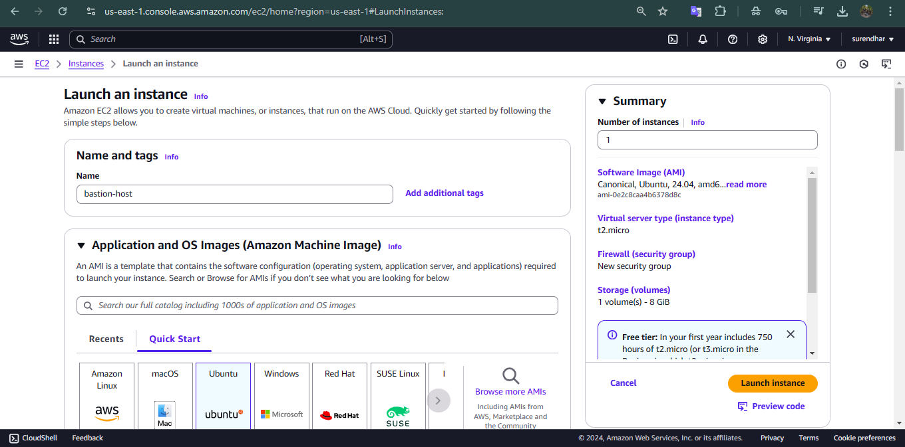

5.Select an Instance Type: 
6.Choose an instance type that matches your performance and cost requirements. For example: 
a. t2.micro is suitable for lightweight workloads and is free-tier eligible. 
b. For larger workloads, select an instance type with more CPU or memory. 
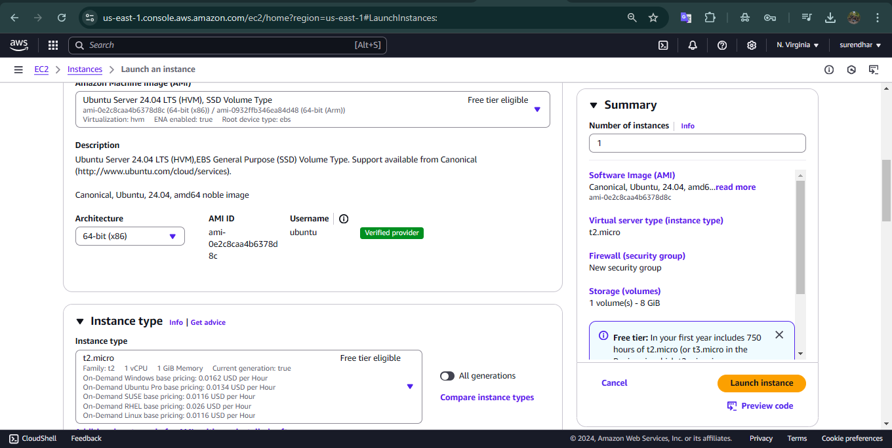

7.Configure the Network Settings: 
8.Under Network settings, choose the VPC you want the instance to be part of. 
9.Select a public subnet within your VPC. 
10.Enable Auto-assign Public IP to ensure your instance can be accessed from the internet. 
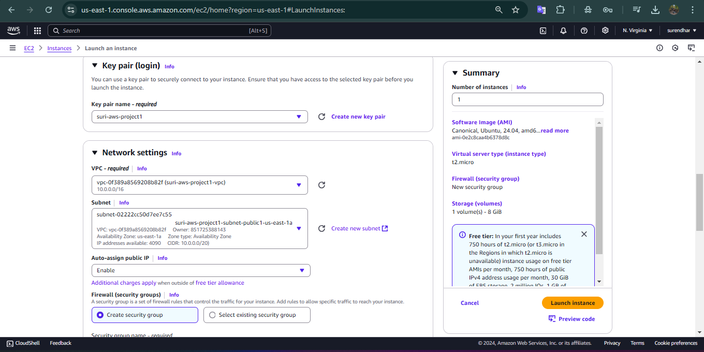

 **11.Set Up a Security Group.**  
**12.Choose a Security Group:** Select an existing group or create a new one as per your requirements.   
 **13.Configure Security Rules:** Ensure the following inbound rules are added:  
#### a.Inbound Rules:  
        i. SSH Access: Protocol: TCP, Port: 22, Source: Anywhere or your specific IP address. 
        ii. HTTP Access: Protocol: TCP, Port: 80, Source: Anywhere (if hosting a website).  
 **14.Review and Launch Your Instance.**  
 **15.Verify Configurations**: Double-check all settings, such as AMI, instance type, storage, and networking configurations.  
**16.Launch the Instance:** Click the launch button and select a Key Pair for SSH access. If a key pair does not exist, create one and download it securely.  
#### 17.Validate the Instance Setup.  
**18.Navigate to Instances Section:** In the EC2 dashboard, confirm the instance is listed.  
**19.Verify Instance State:** Ensure the instance status is “Running” and note the Public IP Address.  
**20.Test Connectivity:** Use the public IP to connect via SSH or verify web accessibility if applicable.  
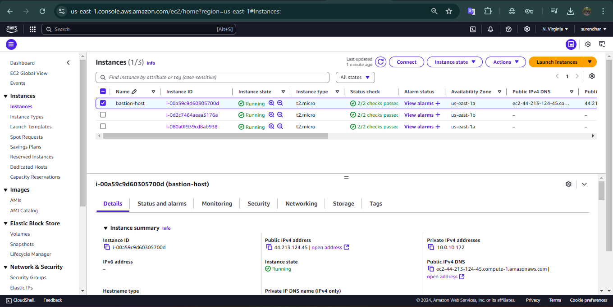

## STEP 4: Create a Load Balancer
### 1.Access the EC2 Dashboard:  
a. **Log in to the AWS Management Console:** Use your credentials to access the console.  
b. **Navigate to the EC2 Service:** Go to Services and select EC2 from the menu.  
c. **Select Load Balancers:** In the EC2 dashboard, find the Load Balancing section on the left-hand menu and click on Load Balancers.  

### 2.Create a Load Balancer:  
a. **Initiate Load Balancer Creation**: Click the Create Load Balancer button.  
b. **Choose the Load Balancer Type:** Select Application Load Balancer (ALB) for distributing HTTP/HTTPS traffic.  

### 3.Configure Load Balancer Settings:  
a.**Name the Load Balancer:** Enter a unique name in the Name field.  
b.**Set the Scheme:** Choose Internet-facing to allow external traffic access to your Load Balancer. 
c.Choose IPv4 as the IP Address Type. 
d. Under Network Mapping, select the VPC you created previously.  
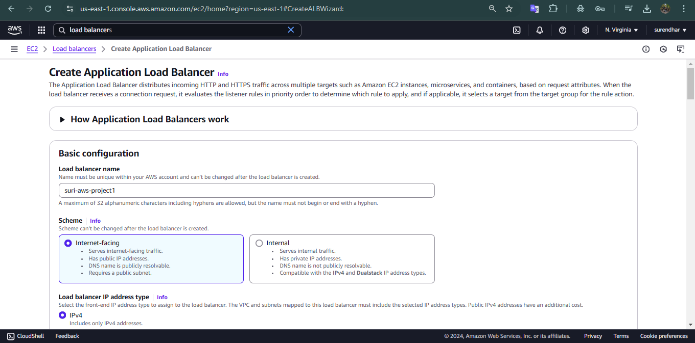

### 4. Enable Availability Zones:  
   a. Choose at least two **Availability Zones** to ensure high availability.  
   b. Select the **Public Subnets** corresponding to each Availability Zone where your instances are running.  
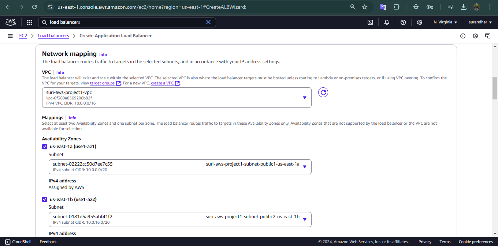

### 5.Set Up the Security Group:
   a. Assign a Security Group that permits traffic to the Load Balancer.  
   b. Ensure the Security Group includes the following inbound rules:  
      i. **HTTP:** Protocol: TCP, Port: 80, Source: Anywhere.  
      ii. **HTTPS:** Protocol: TCP, Port: 443, Source: Anywhere (if SSL is being used).  

### 6.Configure Security Settings (Optional):
   a. If using HTTPS, set up the SSL Certificate at this step. Otherwise, proceed without changes.  

### 7.Set Up Routing Settings:
   a. Under the **Routing** section, create a new Target Group by selecting **Create a new target group**.  

### 8.Create a Target Group: 
   a. Provide a name for the Target Group.  
   b. Set the **Target Type** to **Instances** to distribute incoming traffic among EC2 instances.  
   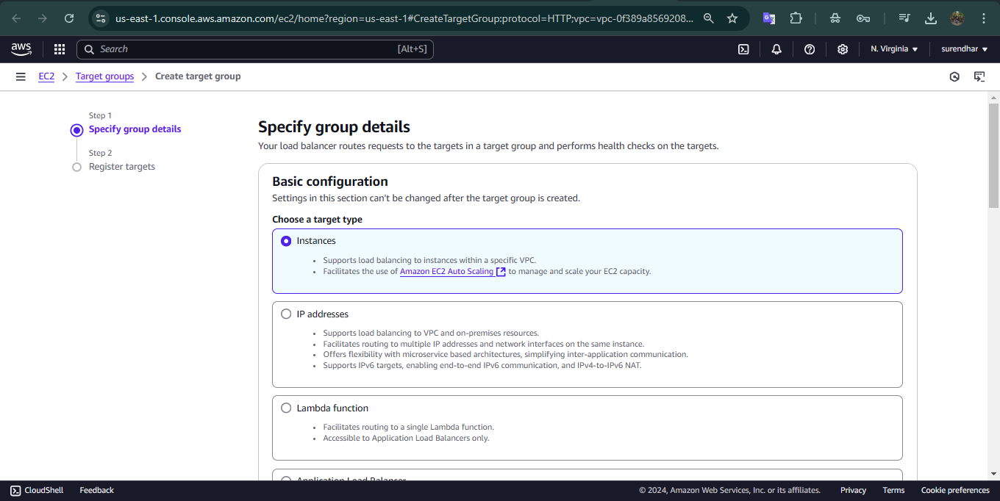

   c. Select the VPC where your instances are deployed.
   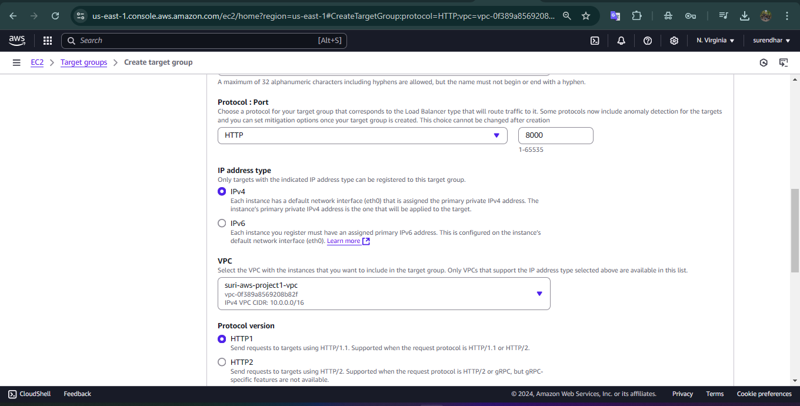
### 9.Configure Health Check Settings:
   a. **Protocol:** Select either **HTTP** or **HTTPS** for the health check.  
   b. **Path:** Define the health check path, such as **/index.html**. 
### 10.Register Targets: 
    a. Select the EC2 instances to add to the Target Group.  
    b. Click Include as targets to associate the selected instances.  
    c. Click Next: Review to continue.  

### 11.Finalize the Target Group: 
    a. Review the configuration details carefully.  
    b. Click Create target group to complete the process. 

 

### 12.Link the Target Group to the Load Balancer:
    a. Return to the Load Balancer configuration after creating the Target Group.  
    b. Select the newly created Target Group and associate it with the Load Balancer.  

### 13.Review and Finalize the Load Balancer: 
    a. Verify all settings, including availability zones, security groups, and the linked Target Group.  
    b. Click Create Load Balancer to complete the configuration.   
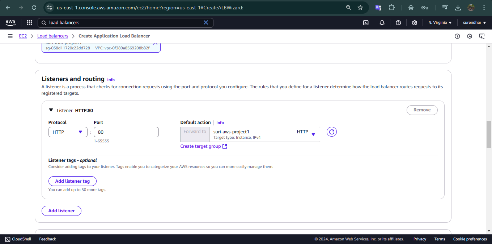
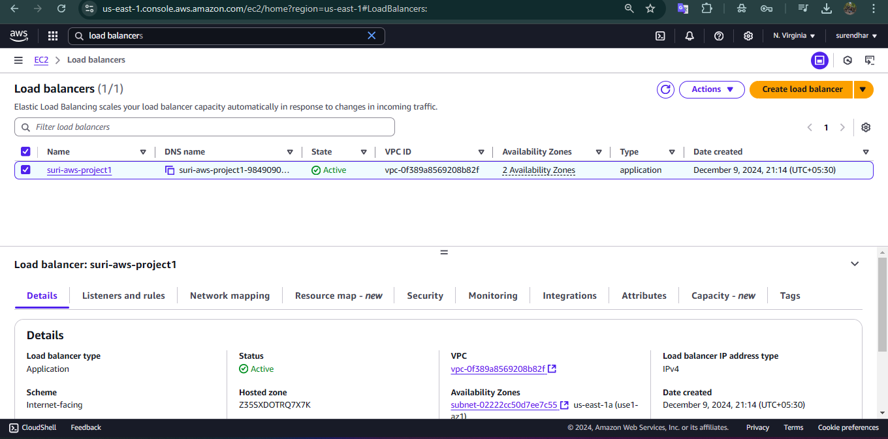

## STEP 5: SSH into Private Instance via Bastion Host and Deploy Application
### I: SSH into the Bastion Host

#### 1.Ensure the PEM File is Accessible:
a. Confirm that your .pem file (key pair) is available on your local machine.
b. If needed, rename the file to avoid spaces in the filename (e.g., suri-aws-project1.pem instead of suri aws project1.pem).

#### 2.Copy the PEM File to the Bastion Host:
a. Use the scp command to securely transfer the .pem file to the Bastion Host.
b. Replace <local_pem_path> with the location of the PEM file on your local machine, and <bastion_host_ip> with the public IP address of your Bastion Host.

scp -i  C:\Users\IBM\Downloads\suri-aws-project1.pem   C:\Users\IBM\Downloads\suri-aws-project1.pem  ubuntu@44.213.124.45:/home/ubuntu

#### 3.SSH into the Bastion Host:
a. Use the ssh command along with the Bastion Host's public IP address and the .pem file to establish a connection.
ssh -i suri-aws-project1.pem ubuntu@44.213.124.45

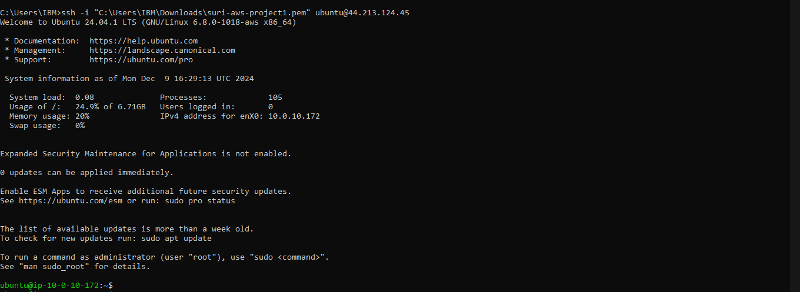

#### 4.Set Permissions for the PEM File:
a. On the Bastion Host, ensure that the .pem file has the correct permissions to maintain security. Use the following command. 
    chmod 400 suri-aws-project1.pem

### Step 2: SSH into the Private Instance
#### 1.Log into the Private Instance from the Bastion Host:
a. Use the Private Instance's private IP address to SSH into it from the Bastion Host.
    ssh -i suri-aws-project1.pem ubuntu@44.213.124.45
#### 2.Verify Connectivity:
a. Run the following command on the Bastion Host to confirm the presence of the PEM file before attempting to SSH.
    ls
