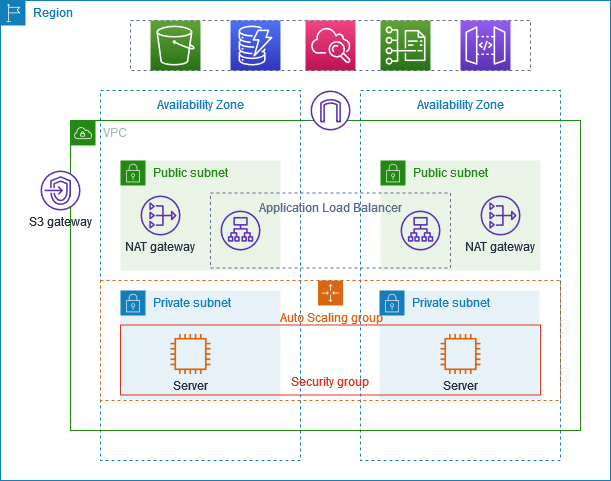
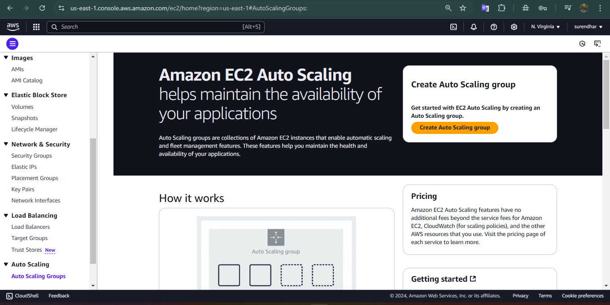
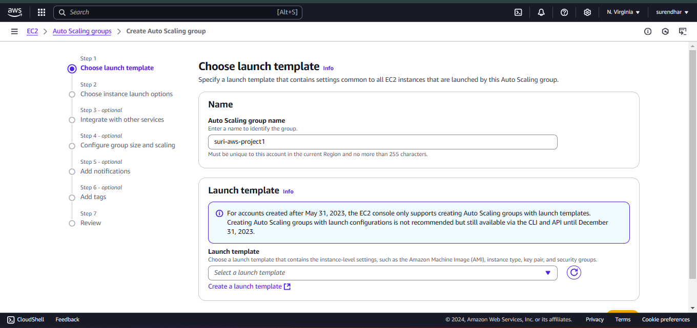
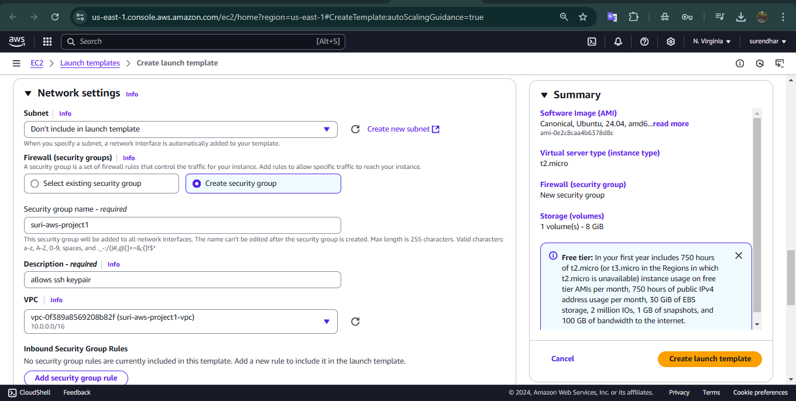
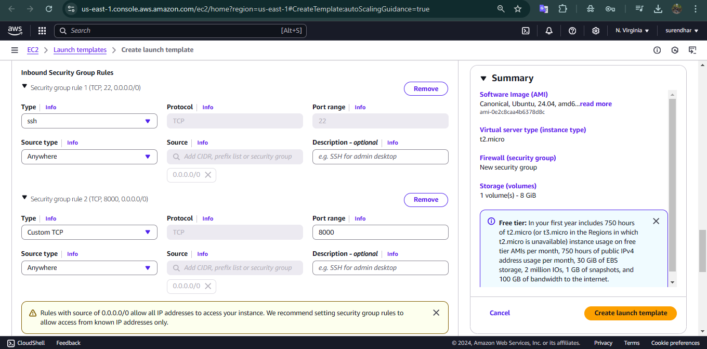

# VPC with servers in private subnets and NAT
## OVERVIEW:
In this project,entailed the design, implementation, and configuration of a highly secure and scalable Virtual Private Cloud (VPC) on Amazon Web Services (AWS), tailored to support the deployment of web applications and services. The VPC architecture features a sophisticated network topology, comprising public and private subnets, each configured with customized routing tables and access controls. This design enables seamless communication between internal components, while providing tightly controlled internet access through carefully configured network address translation (NAT) gateways and security groups, thereby ensuring the confidentiality, integrity, and availability of sensitive data and applications.

## STEP 1:  Log in to AWS Management Console
a.Navigate to the AWS Management Console and ensure you are in the region where you want to create the VPC.
## STEP 2: Create a New VPC
### 1.Go to VPC Dashboard:
a.In the AWS Console, search for VPC in the search bar and click on it.

### 2.Create the New VPC:
a.Click Create VPC. 
b.Choose "Create VPC and more". 
c.Name your VPC, define an IPv4 CIDR block (network range), and select a default tenancy. 

### 3.Configure Subnets:
a.For high availability, pick at least 2 Availability Zones. 
b.Create public and private subnets for resource management (e.g., 1public, 2private). 
c.Set up a NAT gateway choose 1 per AZ. 
d.Leave VPC endpoints as "None" unless required. 

### 4. Create VPC:
e.Click "Create VPC" to complete the setup. 

## STEP 3:Create an Auto Scaling Group
### 1.Navigate to the EC2 Console.
a. Navigate to Services > EC2 under the Compute section. 
b.Select "Auto Scaling groups" from the menu .  
c.Click Create Auto Scaling group. 

### 2.Create a Launch Template:
a.Open the AWS Management Console and go to the EC2 dashboard after click on Launch Templates option in EC2 dashbord. 
b.Click the "Create launch template" button. 

c.Provide a Name and Description for your launch template.  

d.Select a Amazon Machine Image AMI (Ubuntu server). 
e.Select a free tier eligible instance type(eg.t2.micro). 
f.Create the key pair (use same key pair). 

### 3.Create a Security Group:
a.Click the "Create Security Group" button. 
b.Provide a Name and Description for the security group. 

### 4.Configure Security Group Rules:
#### I.Inbound Rules:
Type: SSH, Protocol: TCP, Port Range: 22, Source: Anywhere IPv4 
Type : All Traffic , Protocol: All, Port Range: All, Source: Anywhere IPv4 
Type: All TCP, Protocol: TCP, Port Range: All, Source: Anywhere IPv4 

#### II.Outbound Rules:
Type: All Traffic, Protocol: All, Port Range: All, Destination: Anywhere IPv4 
Click "Create Security Group" to finalize. 
### 5.Save the Launch Template:
a.Set any additional configurations as needed. 
b.Click "Create launch template" to save your configuration. 

### 6.Configure Auto Scaling Group Settings:
a.Enter a name for your Auto Scaling group. 
b.Choose a pre-created Launch Template defining your instance configuration. 
c.Select the VPC where your instances will be launched. 
d.Choose private subnets with in the selected VPC. 

### 7.Scaling Settings:
a.Minimum Capacity: Set the minimum number of instances (select2). 
b.Maximum Capacity: Set the maximum number of instances (select4). 
c.Desired Capacity: Set the initial number of instances (select 2). 

### 8.Finalize the Auto Scaling Group:
a.Configure any additional settings as needed.
b.click Create Auto Scaling group. 

